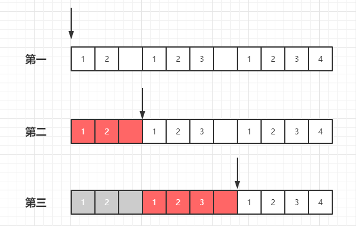

# 字符匹配

## 1-1.横向模糊匹配

> 匹配不同长度的字符。

-   量词

## 1-2.纵向匹配

> 匹配不同的字符。

-   元字符
-   字符组

## 1-3.量词

> {m,n} 最少出现 m 次，最多出现 n 次。

## 1-4.贪婪匹配

> 尽可能匹配符合规则的出现次数最多字符

部分量词是贪婪匹配的，比如：
- {m, n} 注意 `m < n`
- {m,}
- ?
- \+
- \*

{m} 就不是贪婪匹配，因为该量词明确表示出现 m 次。

#### 例子分析

:candy:全局匹配
```js
var regex = /\d{2,5}/g;
var string = "12 123 1234 12345 123456";
console.log( string.match(regex) );
// => ["12", "123", "1234", "12345", "12345"]
```

:candy:非全局匹配
```js
var regex = /\d{2,5}/;
var string = "12 123 1234 12345 123456";
console.log( string.match(regex) );
// => ["12", "123", "1234", "12345", "12345"]
```


以上两个例子的疑惑与解答：

1. 例一中为什么匹配不到`23`、`234`、`456`这样的字符串   

有这个疑惑是因为对贪婪匹配和全局匹配的理解不够透彻。

分析：第一个例子的结果是贪婪匹配和全局匹配共同作用下的结果。

-   全局匹配的规则：匹配到第一个后，继续向下匹配，注意全局匹配是有顺序的。
-   在匹配每一个结果是，匹配出现次数最多的字符串。

`\d{2,5}` 表示匹配出现2次到5次之间数字字符串，过程如下(下图是我个人理解，不一定准确。)：




当执行到第二步时，因为第3个字符为空字符串，所以符合`\d{2,5}` 的字符串是 `12`;   
因为是全局匹配，所以继续匹配下一个符合条件的字符串;   
当执行到第三步时，因为第7个字符为空字符串，所以符合`\d{2,5}` 的字符串有 `12` 或者 `123`，但是因为这里是贪婪匹配，所以最后匹配的是 `123`。

解答：通过上述分析，可以知道，在贪婪匹配情况，只会尽可能匹配出现次数多的，而不会匹配出现次数少的；
另外因为全局匹配是按顺序的，一个字符是不能重复匹配的。


:candy: 这个就可以匹配到 `456`
```js
var regex = /\d{3}/g;
var string = "12 123 1234 12345 123456";
console.log( string.match(regex) );
// =>  ["123", "123", "123", "123", "456"]
```


## 1-5.惰性匹配

> 针对部分量词，可以理解成尽可能匹配符合规则的出现次数最少字符

在量词后面加个`?`实现惰性匹配。例如:`{m,n}?` 

:candy:惰性匹配
```js
var regex = /\d{2,5}?/g;
var string = "12 123 1234 12345 123456";
console.log( string.match(regex) );
// =>  ["12", "12", "12", "34", "12", "34", "12", "34", "56"]
```

分析：虽然规则`\d{2,5}`可以匹配出现5次的字符，但是在惰性匹配作用下，只会匹配出现次数最少的，即出现2次的字符。   
这里因为全局匹配的作用，以`1234` 为例，当第一个`12`匹配完成，剩下的`34`还存在符合规则的结果，所以会继续匹配，`123456`也是同样的道理。

## 1-6.多选分支

用`|`(管道符)分隔子模式，例如：`(r1|r2|r3)`, 表示结果是符合其中规则之一。

多选分支是惰性匹配，即如果字符串符合`r1`和`r2`的规则，结果将是前面的规则 r1


:candy: 短的在前
```js
var regex = /good|goodbye/g;
var string = "goodbye";
console.log( string.match(regex) );
// => ["good"]
```

:candy: 长的在前
```js
var regex = /goodbye|good/g;
var string = "goodbye";
console.log( string.match(regex) );
// => ["goodbye"]
```

从这里可以看出，`惰性匹配`应该是更为抽象的定义：**当有多个规则时，匹配最前面的规则**

`\d{2,5}` 可以用多选分支表示成 `\d{2}|\d{3}|\d{4}|\d{5}`

#### 例子分析

:candy: 用多选分支表示 {m,n}
```js
var regex = /\d{2}|\d{3}|\d{4}|\d{5}/g;
var string = "12 123 1234 12345 123456";
console.log( string.match(regex) );
// =>   ["12", "12", "12", "34", "12", "34", "12", "34", "56"]
```

分析：因为每个连续的数字字符串中，都有符合`\d{2}`的字符串，所以不会再匹配`\d{3}`、`\d{4}`、`\d{5}`


:candy:改变顺序，把 5 放到最前面
```js
var regex = /\d{5}|\d{3}|\d{4}|\d{2}/g;
var string = "12 123 1234 12345 123456";
console.log( string.match(regex) );
// =>    ["12", "123", "123", "12345", "12345"]
```

分析：匹配顺序是`\d{5}`、`\d{3}`、`\d{4}`、`\d{2}`，所以对于连续的数字字符串，只要前面的规则满足，就不会再匹配剩下的规则。

- 以`12345` 为例，符合`\d{5}`，所以不再匹配`\d{3}`、`\d{4}`、`\d{2}`
- 以`1234` 为例，不符合`\d{5}`, 符合`\d{3}`，所以不再匹配`\d{4}`、`\d{2}`
- 以`123` 为例，不符合`\d{5}`, 符合`\d{3}`，所以不再匹配`\d{4}`、`\d{2}`


