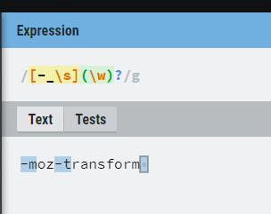

# 括号对应的练习题

## 一、trim 方法模拟

trim 方法是去掉字符串的开头和结尾的空白符。

1.1 直观的思路

- 纵向匹配
  空白符可以通过元字符 `\s` 来匹配

- 横向匹配
  空白符可能是多个，可以使用量词 `+` 来匹配(`*` 其实也可以，只不过出现0次的情况没必要处理)

- 匹配开头的空白符
  在上一步的基础加上 `^`


:candy: 
```js
function trim(str) {
  const regex = /^\s+|\s+$/g;
  return str.replace(regex, '');
}
console.log(trim('   hahaha   '))
```

1.2 把中间的字符提取出来

- 匹配开头和结尾的空白符
  这里和方法一就有所不同了，这里使用量词 `*` 更合适
  因为开头和结尾不一定存在空白符，如果使用了 `+` 将无法匹配到无空白符的情况。

- 使用括号捕获中间的字符串
  如果单纯的使用 `(.*)`，因为量词是贪婪匹配的，所以会把后面的空白符也匹配进来
  
  所以这里需要使用 `?` 来惰性匹配

- 额外补充

  因为使用了 `^` 和 `$`,所以匹配出来的结果一定是从开头到结尾中间的所有字符

  因为中间的规则是惰性匹配，开头和结尾的空白符都是贪婪匹配，所以剩下都是中间字符。

  如果没有使用`^` 和 `$`，中间还是惰性匹配，就匹配不到中间的字符了。

:candy: 
```js
function trim(str) {
  return str.replace(/^\s*(.*?)\s*$/g, "$1");
}
console.log(trim('   hahaha   '))
```

## 二、将每个单词的首字母转换为大写

如何找到首字母？

- 开头的字母

- 空格后面的第一个字母

一个小技巧就是先把所有的字母转换成小写。

需要注意的是，正则匹配到的是**空格+字母**，而我们只会把首字母转换成大写

:candy: 
```js
function titleize (str) {
  return str.toLowerCase().replace(/(^|\s)(\w)/g, function (match, $1, $2) {
    return $2 && $1 + $2.toUpperCase();
  });
}
console.log( titleize('my name is epeli') );
// => "My Name Is Epeli"
```

## 三、驼峰化

把下划线、中横线、空白符等删除，并把首个字母转换为大写

需要注意的是，我们是用转换成大写的字母替代了正则匹配到的是**空格+字母**



注意：这里对字母使用了量词 `?`，用来对末尾出现下划线、中横线、空白符的处理

:candy: 
```js
function camelize (str) {
  return str.toLowerCase().replace(/[_-\s](\w)?/g, function (match, $1) {
    return $1 ? $1.toUpperCase() : '';
  });
}
console.log( camelize('-moz-transform') );
// => "MozTransform"
```

## 四、中横线化

把大写字母变成 **中横线 + 小写字母**

:candy: 
```js
function dasherize (str) {
  return str.replace(/[A-Z]/g, function (match) {
    return '-' + match.toLowerCase();
  });
}
console.log( dasherize('MozTransform') );
// => "-moz-transform"
```

## 五、HTML 转义

|   特殊字符  | 实体  |
|  ----  | ----  |
| <  | &lt; |
| >  | &gt; |
| "  | &quot; |
| &  | &amp; |
| '  | &#39; |

注意：单引号或者双引号的转义


:candy: 
```js
function escapeHTML (str) {
  const escapeChars = {
  '<' : 'lt',
  '>' : 'gt',
  '"' : 'quot',
  '&' : 'amp',
  '\'' : '#39'
  };

  return str.replace(/[<>"&']/g, function (match) {
    return `&${escapeChars[match]};`
  });
}
console.log( escapeHTML("<div>Blah' \" & blah blah</div>") );
// => "&lt;div&gt;Blah&#39; &quot; &amp; blah blah&lt;/div&gt;";
```


## 六、HTML 反转义

:candy: 
```js
function unescapeHTML (str) {
  const htmlEntities = {
    nbsp: ' ',
    lt: '<',
    gt: '>',
    quot: '"',
    amp: '&',
    apos: '\'',
    '#39': '\''
  };

  return str.replace(/&([^;]+);/g, function (match, $1) {
    return htmlEntities[$1] || ''
  });
}
console.log( unescapeHTML("&lt;div&gt;Blah&#39; &quot; &amp; blah blah&lt;/div&gt;") );
// => "<div>Blah' \" & blah blah</div>"
```

## 七、匹配成对标签

不考虑嵌套

要求匹配

```html
<div>hahaha</div>
<p>hahah</p>
```

不匹配

```html
<div>error</p>
```

可以考虑使用分组捕获，并反向引用

相对于书中的正则，这里对左右箭头做了进一步处理

不匹配

```html
<di<v>左侧标签中有还存在箭头</p>
<div>>中间存在箭头</p>
<div>右侧标签中有还存在箭头</p<>
```

:candy: 
```js
var regex = /<([^<>]+)>[^<>]*<\/\1>/;
var string1 = "<title>regular expression</title>";
var string2 = "<p>laoyao bye bye</p>";
var string3 = "<title>wrong!</p>";
var string4 = "<di<v>左侧标签中有还存在箭头</p>";
var string5 = "<div>>中间存在箭头</p>";
var string6 = "<div>右侧标签中有还存在箭头</p<>";
console.log( regex.test(string1) ); // true
console.log( regex.test(string2) ); // true
console.log( regex.test(string3) ); // false
console.log( regex.test(string4) ); // false
console.log( regex.test(string5) ); // false
console.log( regex.test(string6) ); // false
```


